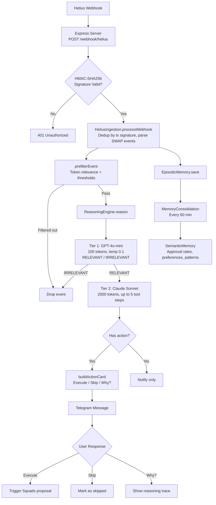
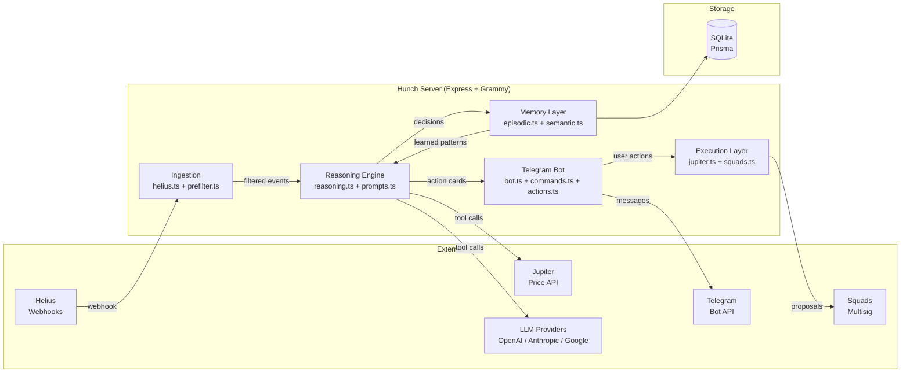
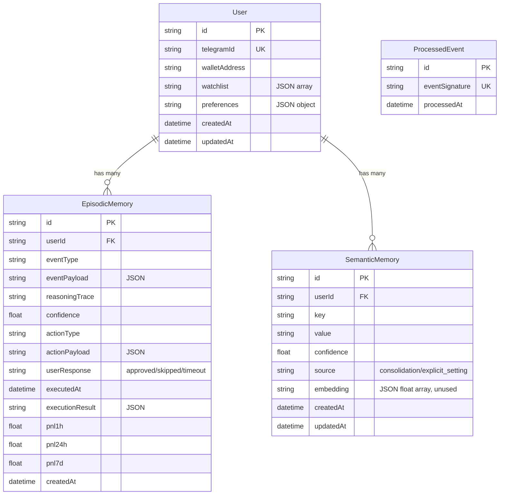

# Hunch

Your hunch, smarter. An agent that reasons about onchain events from your history.

## What is Hunch?

Hunch is an LLM-powered agent that:
1. Monitors Solana onchain events (price changes, whale transactions, DeFi positions)
2. Reasons about what events mean for YOUR portfolio using your decision history
3. Suggests actions with transparent reasoning traces
4. Executes after your approval via Squads multisig

Unlike generic alert services, Hunch learns from your behavior and personalizes suggestions.

## Quick Start

### Prerequisites
- Node.js 18+
- Telegram Bot Token (from @BotFather)
- Helius API Key + Webhook Secret (from helius.dev)
- At least one LLM API Key (Anthropic, OpenAI, or Google)

### Setup

1. Clone and install:
```bash
git clone https://github.com/yourusername/hunch.git
cd hunch
npm install
```

2. Configure environment:
```bash
cp .env.example .env
# Edit .env with your keys
```

Required env vars:
- `DATABASE_URL` - SQLite path (default: `file:./hunch.db`)
- `TELEGRAM_BOT_TOKEN` - from @BotFather
- `HELIUS_API_KEY` + `HELIUS_WEBHOOK_SECRET` - from helius.dev
- At least one of: `ANTHROPIC_API_KEY`, `OPENAI_API_KEY`, `GOOGLE_API_KEY`

Optional:
- `SOLANA_RPC_URL` - defaults to mainnet-beta public RPC
- `SQUADS_MULTISIG_ADDRESS` - for execution (not needed for read-only use)
- `AGENT_KEYPAIR_PATH` - agent wallet keypair file path

3. Run migrations:
```bash
npm run db:migrate
```

4. Start the agent:
```bash
npm run dev
```

5. Open Telegram and message your bot `/start`

## Architecture

### Data Flow



### System Architecture



### Components

- **Event Ingestion**: Helius webhook for onchain events (signature-verified)
- **Pre-filter**: Rule-based filtering by token relevance, thresholds, and event type
- **Reasoning Engine**: LLM with tool use via Vercel AI SDK (provider-agnostic)
- **Memory**: Episodic (raw decisions + PnL tracking) + Semantic (consolidated patterns)
- **Execution**: Jupiter for quotes/swaps, Squads multisig for non-custodial approval
- **Telegram Bot**: Grammy-based bot with inline keyboard actions

### Two-Tier Reasoning

1. **Tier 1 (Triage)**: GPT-4o-mini, 100 max tokens, structured RELEVANT/IRRELEVANT verdict
2. **Tier 2 (Deep Reasoning)**: Claude Sonnet with tool use, up to 5 steps, 2000 max tokens

### Project Structure

```
hunch/
  src/
    index.ts                    # Entry point: Express server + Telegram bot + consolidation timer
    config/
      env.ts                    # Zod-validated env vars
      providers.ts              # LLM provider factory (anthropic/openai/google)
    ingestion/
      events.ts                 # OnchainEvent type definitions (price_change, whale_tx, defi_position)
      helius.ts                 # Helius webhook parser + Jupiter price fetcher
      prefilter.ts              # Rule-based event filtering
    agent/
      prompts.ts                # System prompt + reasoning prompt builder
      reasoning.ts              # Two-tier LLM reasoning with tool use
    memory/
      types.ts                  # EpisodicMemoryData, SemanticMemoryData, UserPreferences
      episodic.ts               # CRUD for decision records (Prisma/SQLite)
      semantic.ts               # CRUD for learned patterns (Prisma/SQLite)
      vector.ts                 # Cosine similarity + simpleEmbed (unused in production)
      consolidation.ts          # Pattern extraction from episodic -> semantic
    execution/
      jupiter.ts                # Jupiter quote API + swap simulation (swap tx is stub)
      squads.ts                 # Squads multisig proposal/approval (all stubs)
    telegram/
      bot.ts                    # Grammy bot setup with session
      commands.ts               # /start, /wallet, /preferences, /history, /help
      actions.ts                # Inline keyboard callbacks (execute/skip/why)
    lib/
      db.ts                     # Prisma client singleton (better-sqlite3 adapter)
  prisma/
    schema.prisma               # User, EpisodicMemory, SemanticMemory, ProcessedEvent
  tests/
    unit/
      prefilter.test.ts         # 8 tests covering all event types + edge cases
  dashboard/                    # Next.js 16 app
    app/
      page.tsx                  # Activity Feed
      history/page.tsx          # Decision history
      memory/page.tsx           # Learned patterns
```

### Database Schema



### Design Decisions

**Single-user mode**: The webhook handler grabs `prisma.user.findFirst()` - designed for hackathon demo with one user. Multi-user would need to match wallet addresses to users.

**SQLite via better-sqlite3**: Chosen for simplicity. Prisma adapter pattern makes it swappable to Postgres later.

**In-memory dedup over DB dedup**: `HeliusIngestion.processedEvents` Set with 10k LRU is faster than hitting SQLite for every webhook. The `ProcessedEvent` table is schema-only.

**No session persistence**: Grammy's default in-memory session means watchlist and wallet reset on restart. Production would need Redis or DB-backed session.

**Consolidation runs hourly**: `setInterval` at 60 minutes. Reads last 200 episodic memories per user, extracts patterns, upserts to semantic memory. Simple frequency-based pattern extraction, not ML-based.

## LLM Providers

Hunch supports multiple LLM providers via Vercel AI SDK:

| Provider | Models | Use Case |
|----------|--------|----------|
| Anthropic | Claude Opus, Sonnet, Haiku | Best reasoning |
| OpenAI | GPT-4o, GPT-4o-mini, o1 | Good balance |
| Google | Gemini Pro, Flash | Fast, cheap |

Users bring their own API keys (BYOK). The default config uses OpenAI for Tier 1 triage and Anthropic for Tier 2 deep reasoning.

## Commands

| Command | Description |
|---------|-------------|
| `/start` | Welcome and setup |
| `/wallet` | Connect Squads multisig |
| `/preferences` | Set alert thresholds |
| `/history` | View past decisions |
| `/help` | Show commands |

## Development

```bash
npm run dev          # Start with hot reload
npm run test         # Run tests
npm run db:migrate   # Run database migrations
npm run build        # Build for production
```

## Dashboard

The web dashboard is a separate Next.js app with three pages:

| Page | Path | Description |
|------|------|-------------|
| Activity Feed | `/` | Recent decisions and reasoning |
| History | `/history` | Past decision history |
| Memory | `/memory` | Learned preferences and patterns |

```bash
cd dashboard
npm install
npm run dev
```

## Current Status

Core features working:
- Helius webhook ingestion with signature verification
- Rule-based prefiltering (price, whale, DeFi position events)
- Two-tier LLM reasoning (triage + deep reasoning with tool use)
- Episodic + semantic memory with pattern consolidation
- Telegram bot with /start, /wallet, /preferences, /history, /help commands
- Inline action cards (Execute / Skip / Why?)

Stub features (not yet wired up):
- `userPositionTool` - DeFi position lookup returns placeholder
- `userHistoryTool` - semantic history search returns placeholder
- Jupiter swap transaction building (getSwapTransaction is a stub)
- Squads multisig proposal/approval (proposeTransaction, approveTransaction are stubs)
- Vector embeddings for semantic memory (cosineSimilarity exists but is unused)

## License

ISC
